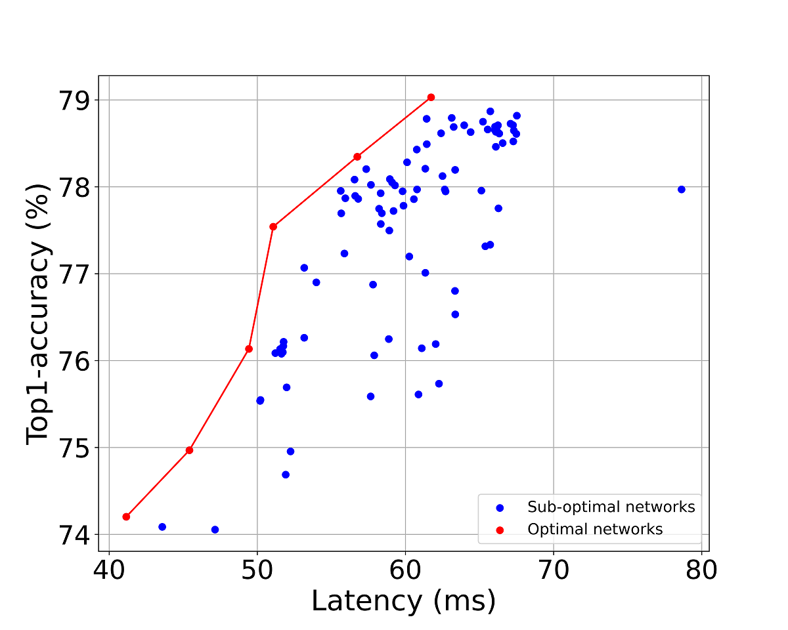

# Dynamic-OFA
Offical repo for paper 'Dynamic-OFA: Runtime DNN Architecture Switching for Performance Scaling on Heterogeneous Embedded Platforms'.

> [**Dynamic-OFA: Runtime DNN Architecture Switching for Performance Scaling on Heterogeneous Embedded Platforms**](https://arxiv.org/abs/2105.03596),  
> Wei Lou*, Lei Xun*, Amin Sabet, Jia Bi, Jonathon Hare, Geoff V. Merrett   
> In Conference on Computer Vision and Pattern Recognition Workshops (CVPRW), 2021  
> *arXiv preprint ([arXiv 2105.03596](https://arxiv.org/abs/2105.03596))*   

## About Dynamic-OFA
Using pre-trained OFA networks that contain 2*10^19 sub-network architectures as the backbone, sub-network architectures are sampled from OFA for both CPU and GPU at the offline stage. These architectures have different performance (e.g. latency, accuracy) and are stored in a look-up table to build a dynamic version of OFA without any additional training required. Then, at runtime, Dynamic-OFA selects and switches to optimal sub-network architectures to fit time-varying available hardware resources.

## Usage
### Optimal Search
The optimal search process aims at searching for optimal sub-networks on the pareto front from all the sub-networks of OFA model. 

This code can be used for different mobile and embedded devices. For different devices, the accuracy predictor and flop look-up table are the same which are restored in optimal_search/flop&latency/checkpoints repository, however, the specilaized latency look-up lables need to be built based on each device. 

The search can be constrainted either by latency or FLOPs, only with different pre-calculated look-up tables. After searching for certain number of sub-networks, please do re-measure the latency and accuracy on your device since predictor and loop-up table is not 100% accurate, and then use re-measured data to build a latency-accuracy scatter plot to find those points on the pareto front.
### Searching
    For latency based search: 
        Search without accuracy constraint: python optimal_search/latency/search.py (The latency value is corresponding to evolution_finder.py)
        Search with accuracy constraint: python optimal_search/latency/search_accu.py (The latency value is corresponding to evolution_finder_accu.py)
        
    For flop based search:
        python optimal_search/flop/flop_search.py
    
### Evaluation
    python optimal_search/latency/evaluation.py (For GPU)
    python optimal_search/latency/evaluation_cpu.py (For CPU)
    
    Please change the devices of all the function in imagenet_eval_helper.py
    
### Examples of optimal search results
{:height="50%" width="50%"}

## Q&A
We are constantly improving the readability and useability of our codebase. Any feedback and questions for our paper and code are welcomed, please leave them as GitHub issues.
    
