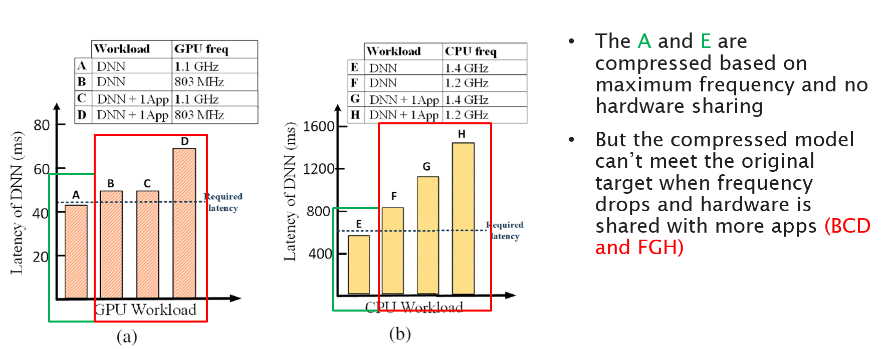
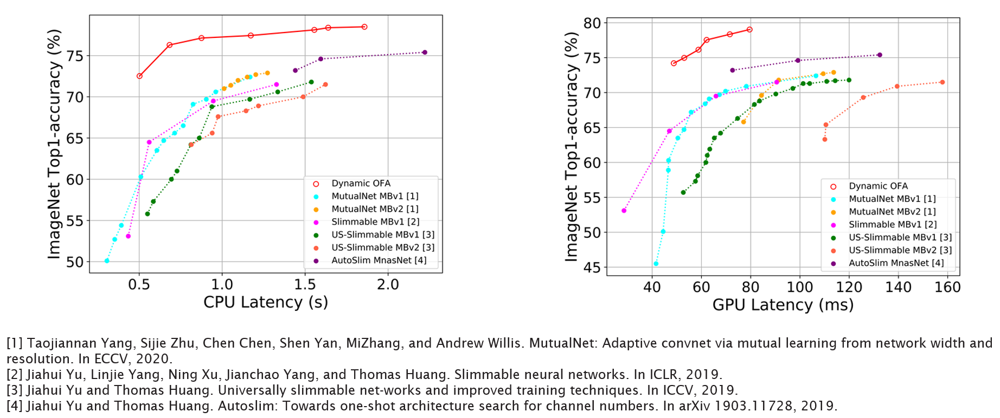

# Dynamic-OFA
Offical repo for paper 'Dynamic-OFA: Runtime DNN Architecture Switching for Performance Scaling on Heterogeneous Embedded Platforms'.

> [**Dynamic-OFA: Runtime DNN Architecture Switching for Performance Scaling on Heterogeneous Embedded Platforms**](https://arxiv.org/abs/2105.03596),  
> Wei Lou*, Lei Xun*, Amin Sabet, Jia Bi, Jonathon Hare, Geoff V. Merrett   
> In Conference on Computer Vision and Pattern Recognition Workshops (CVPRW), 2021  
> *arXiv preprint ([arXiv 2105.03596](https://arxiv.org/abs/2105.03596))*   

## About Dynamic-OFA
### Motivation

Deep neural networks are typically compressed before deployed on embedded platforms because they are very computational intensive for such platforms. However, the assumed hardware resources at a design time (A&E) may not be available at runtime (BCD & FGH). 

To solve this issue, we purpose Dynmaic-OFA which contains a library of optimal sub-networks for different accuracy-latency trade-offs. At runtime, Dynamic-OFA selects and switches to optimal sub-network architectures to fit time-varying available hardware resources.

### Workflow of Dynamic-OFA

Dynamic-OFA uses a pre-trained Once-for-all (OFA) network which contain 2*10^19 sub-network architectures as the backbone. Sub-network architectures are sampled from OFA for both CPU and GPU at the offline stage. These architectures have different performance (e.g. latency, accuracy) and are stored in a look-up table to build a dynamic version of OFA without any additional training required. At online stage, we use runtime manager to choose the optimal sub-network that can constantly meet performance requirements when hardware availability changes.

### Compare with SOTA

### Runtime manager example

## How to use / evaluate Dynamic-OFA Network
### Search for optimal sub-networks
The optimal search process aims at searching for optimal sub-networks on the pareto front from all the sub-networks of OFA model. 

This code can be used for different mobile and embedded devices. For different devices, the accuracy predictor and flop look-up table are the same which are restored in optimal_search/flop&latency/checkpoints repository, however, the specilaized latency look-up lables need to be built based on each device. 

The search can be constrainted either by latency or FLOPs, only with different pre-calculated look-up tables. After searching for certain number of sub-networks, please do re-measure the latency and accuracy on your device since predictor and loop-up table is not 100% accurate, and then use re-measured data to build a latency-accuracy scatter plot to find those points on the pareto front.
### Search
    For latency based search: 
        Search without accuracy constraint: python optimal_search/latency/search.py (The latency value is corresponding to evolution_finder.py)
        Search with accuracy constraint: python optimal_search/latency/search_accu.py (The latency value is corresponding to evolution_finder_accu.py)
        
    For flop based search:
        python optimal_search/flop/flop_search.py
    
### Evaluation
    python optimal_search/latency/evaluation.py (For GPU)
    python optimal_search/latency/evaluation_cpu.py (For CPU)
    
    Please change the devices of all the function in imagenet_eval_helper.py
    
### Examples of optimal search results

### Runtime management
TODO

## Requirement
1. PyTorch and Torchvision (If you use Nvidia Jetso platform, please intall from [here](https://forums.developer.nvidia.com/t/pytorch-for-jetson-version-1-9-0-now-available/72048))
2. Python 3.6+
3. ImageNet dataset

## Q&A
We are constantly improving the readability and useability of our codebase. Any feedback and questions for our paper and code are welcomed, please leave them as GitHub issues.

## Related papers and talks
1. [DATE 2020] Optimising Resource Management for Embedded Machine Learning ([Paper](https://arxiv.org/abs/2105.03608))
2. [TinyML EMEA] Runtime DNN Performance Scaling through Resource Management on Heterogeneous Embedded Platforms ([Talk](https://youtu.be/XW8jBooRPdM))
3. [KTN & eFutures Online Webinar] Adapting AI to Available Resource in Mobile/Embedded Devices ([Talk](https://youtu.be/DnApKW5lk5k))

## Acknowledgements
This work was supported in part by the Engineering and Physical Sciences Research Council (EPSRC) under Grant EP/S030069/1.

[International Centre for Spatial Computational Learning](https://spatialml.net/)

Thanks for the amazing authors of paper [Once-for-All: Train One Network and Specialize it for Efficient Deployment](https://arxiv.org/abs/1908.09791) open source their code and models, so we can do our project based on their codebase. Please do checkout their works at [MIT Han lab](https://songhan.mit.edu/).
